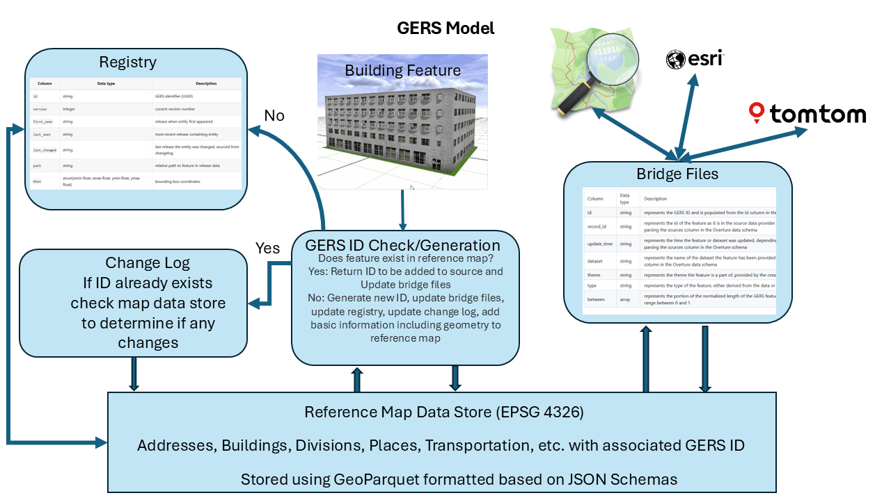

[obligation=informative]

== Global Entity Reference System Concepts

This clause provides information on the concepts essential to the GERS model or framework. 

=== Use cases

In terms of implementation, the GERS framework described below is very flexible and extensible. Following are some use cases ranging from the very simple to more complete implementation of the framework.

At the simplist, an implementation could consist of using an existing deployed framework, such as that provided by Overture Maps Foundation (OMF). In this use case, the end user provides their source data to OMF. OMF processes the data and updates their implementation and then provides the end user information of the GERS IDs associated with each entity (feature) in the source map dataset.

The above use case may meet the needs of some organizations. However, there are many situations that require complete implementations of the framework with no external links to "outside" implementations. These situations include, for example, companies that deal with confidential data that cannot be shared outside their organization. Another situation is where the geospatial data are classified and must remain within a classified environment.

There are also hybrid solutions where some of the data in the application or organization are classfied and/or confidential and other geospatial data may be shared (open data, public domain, etc).

The model of the GERS framework is now described at a high level. Specific details are contained in the normative clause of this Community Standard.

=== GERS Release Concept

A key concept for any operational implementation of the GERS Framework/Model is `release`. A `release` contains information on updates, such as additions and/or changes, to the geospatial data content referenced in a GERS implementation. A `release` is conceptually similar to a checkpoint in database technology. A checkpoint is a point in time in the log when a known and consistent state for the database system is established. In the case of a GERS implementation, the checkpoint is the content of the Registry as published at a given date. Periodically, the Registry (and other GERS files) are updated with updated or added content. Such updates could occur daily, weekly, monthly or whatever time period is deemed appropriate. When the Registry update occurs, this becomes the new `release` (checkpoint). In a GERS implementation, each `release` has a unique version number.

=== The GERS Model - High Level

The following is a high level view of the GERS framework.

Each of the key components is now described.

==== GERS Unique Identifier

GERS IDs are generated and formatted based on the IETF RFC https://datatracker.ietf.org/doc/html/rfc4122[A Universally Unique IDentifier (UUID) URN Namespace]. In an implementation of the GERS framework, every GERS ID follows the standard UUID format (e.g., 12345678-1234-5678-1234-567812345678), making them:

* Globally unique
* System-agnostic
* Easy to implement in any database or application
* Compatible with existing UUID tools and libraries

Why it matters:

* Universal compatibility: UUIDs work in every modern database and programming language
* No collisions: Guaranteed uniqueness across all systems
* Standard tooling: Leverage existing UUID libraries and utilities

==== GERS Registry

A GERS registry is a comprehensive database documenting every GERS ID created in a given GERS implementation.

Think of the GERS Registry as the authoritative phonebook for GERS IDs. It maintains:

* Complete lifecycle information for every ID.
* Current location data for active entities.
* Historical records for deprecated IDs.
* Quick lookup capabilities for ID verification.

Why it matters:

* Validation: Instantly verify if a UUID is a legitimate GERS ID.
* History: Access the complete lifecycle of any GERS ID.
* Efficiency: Quickly “catch up” if you haven’t updated for several releases.
* Location services: Find where entities exist both geographically and within file structures.

==== GERS Bridge File

A bridge file contains mappings between GERS IDs and identifiers used other (source) geospatial datasets. A bridge file can be thought of as join tables .

Why it matters:

* Instant integration: Using a dataset with a bridge file supports quick connection(s) between a GERS implementation and the source geospatial repositories.
* Transparency: See exactly which geospatial data sources were used used to build the reference data.
* Flexibility: You can create your own bridge files to share with the community.

==== GERS Change Log

A GERS change log contains detailed records of all changes made to data referenced in an implementation of the GERS framework. In the OMF implementation, updates to the change log occur between data releases

Why a chnage log? The physical world is constantly changing – new buildings are constructed, businesses move, roads are rerouted. The metadata maintained in a GERS change log documents these changes at the ID level: 

* What new entities were added.
* What entities were removed.
* What modifications to existing entities.

Why it matters:

* Efficient updates: Only process what’s changed instead of reprocessing entire datasets.
* Time savings: If only 200 of your 1,000 matched records have changed, update just those 200.
* Transparency: Understand exactly how and why data evolved between releases.

Examples of using and accessing change logs are available on the OMF web site. Use this information to update only the affected portions of your data pipeline.

==== GERS Reference Map

A GERS reference map contains feature data that connect GERS IDs to real-world entities. 

Data contained in the reference map should be carefully validated, consistently structured collections that describe potentially billions of real-world entities. 

Each entity in the reference map datasets carries a unique GERS ID. These IDs represent actual physical entities in the world, from the corner coffee shop to the roads in a navigation route.

Any implementation of the GERS framework should include or link to a reference map. While a GERS reference map does contain feature geometry and some metadata, content contained in the reference map is not a duplication of the source data. 

Why it matters:

* Open and free: GERS IDs reference elements in a global, open, free, and accessible. There is no risk of lock-in because any ID system can also match with GERS.

