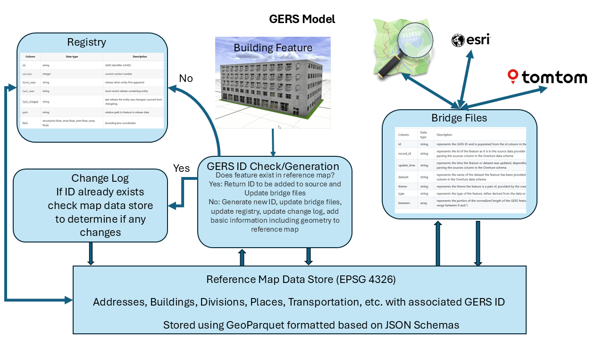

[obligation=informative]

== Global Entity Reference Framework Concepts

This clause provides information on the concepts essential to the GER-ID model and framework (hereafter referred to as the `model` or `framework`. 

=== Use cases

In terms of implementation, the framework described below is very flexible and extensible. Following are some use cases ranging from the very 
simple to more complete implementation of the framework.

At the simplist, an implementation could consist of using an existing deployed framework, such as that provided by Overture Maps Foundation (OMF). 
In this use case, the end user provides their source data to OMF. OMF processes the data and updates their implementation and then provides the 
end user information of the GER-IDs associated with each entity (feature) in the source map dataset.

The above use case may meet the needs of some organizations. However, there are many situations that require complete implementations of the 
framework with no external links to "outside" implementations. These situations include, for example, companies that deal with confidential 
data that cannot be shared outside their organization. Another situation is where the geospatial data are classified and must remain within a classified environment.

There are also hybrid solutions where some of the data in the application or organization are classfied and/or confidential and other geospatial 
data may be shared (open data, public domain, etc).

The model of the framework is now described at a high level. Specific details are contained in the normative clause of this Community Standard.

=== The Release Concept

A key concept for any operational implementation of the GERS Framework/Model is `release`. A `release` contains information on updates, 
such as additions and/or changes, to the geospatial data content referenced in an implementation of the GERS framework. A `release` is 
conceptually similar to a checkpoint in database technology. A checkpoint is a point in time in the log when a known and consistent state 
for the database system is established. In the case of an implementation of the framework, the checkpoint is the content of the 
Registry (and Bridge, ChangeLog, and ReferenceMap datasets) as published at a given date. Periodically, the Registry (and other files in an implementation) 
are updated with changed or added content. Such updates could occur daily, weekly, monthly or whatever time period is deemed appropriate. 
When the Registry update occurs, this becomes the new `release` (checkpoint). In an implementation of the framework, each `release` has a unique version number.

=== The GER-ID Model - High Level

The following is a high level view of the GER-ID Model and Framework.

Each of the key components is now described.

==== The Unique Identifier

GER-IDs are generated and formatted based on the IETF RFC https://datatracker.ietf.org/doc/html/rfc4122[A Universally Unique IDentifier (UUID) URN Namespace]. 
In an implementation of the framework, every GER-ID follows the standard UUIDv4 format. An example of a UUIDv4 ID is `12345678-1234-5678-1234-567812345678)` making them:

* Globally unique
* System-agnostic
* Easy to implement in any database or application
* Compatible with existing UUID tools and libraries

Why it matters:

* Universal compatibility: UUIDs work in every modern database and programming language
* No collisions: Guaranteed uniqueness across all systems
* Standard tooling: Leverage existing UUID libraries and utilities

From RFC 9562: One area in which UUIDs have gained popularity is database keys. This stems from the increasingly distributed nature of modern applications. 
In such cases, "auto-increment" schemes that are often used by databases do not work well: the effort required to coordinate sequential numeric identifiers 
across a network can easily become a burden. The fact that UUIDs can be used to create unique, reasonably short values in distributed systems without 
requiring coordination makes them a good alternative

==== The Registry

A Registry is a comprehensive database documenting every GER-ID created in a given implementation of the framework The Registry maintains:

* Complete lifecycle information for every ID.
* Current location data for active entities.
* Historical records for deprecated IDs.
* Quick lookup capabilities for ID verification.

Why it matters:

* Validation: Instantly verify if a UUID is a legitimate GER-ID.
* History: Access the complete lifecycle of any GERS ID.
* Efficiency: Quickly “catch up” if you haven’t updated for several releases.
* Location services: Find where entities exist both geographically and within file structures.

==== The Bridge File

A Bridge File contains mappings between GER-IDs and identifiers used other (source) geospatial datasets. A Bridge File can be thought of as a join table.

Why it matters:

* Instant integration: Using a dataset with a Bridge File supports quick connection(s) between an implementation of the framework and the source geospatial repositories.
* Transparency: See exactly which geospatial data sources were used used to build the reference data.
* Flexibility: You can create your own bridge files to share with the community.

==== The Change Log

A Change Log instance contains detailed records of all changes made to data referenced in an implementation of the framework. 
For example, in the OMF implementation, updates to the Change Log occur between data releases

Why a Change Log? The physical world is constantly changing – new buildings are constructed, businesses move, roads are rerouted. 
The metadata maintained in a Change Log documents these changes at the ID level: 

* What new entities were added.
* What entities were removed.
* What modifications were made to existing entities.

Why it matters:

* Efficient updates: Only process what is changed instead of reprocessing entire datasets.
* Time savings: If only 200 of your 1,000 matched records have changed, update just those 200.
* Transparency: Understand exactly how and why data evolved between releases.

Examples of using and accessing change logs are available on the OMF web site. Use this information to update only the affected portions of your data pipeline.

==== The Reference Map

The reference map contains feature data that connect GER-IDs to real-world entities. 

Data contained in the reference map should be carefully validated, consistently structured collections that describe potentially billions of real-world entities. 
Each entity in the reference map datasets carries a unique GER-ID. These IDs represent actual physical entities in the world, from the corner coffee shop to the 
roads in a navigation route. Any implementation of the framework should include or link to a reference map. While a reference map does contain feature 
geometry and some metadata, content contained in the reference map does not need to be a complete replication of the source data. There is a minimum set of content 
that is required and hence replicated.  

=== Themes and types

Geospatial data registered in an implementation of the GER-ID framework are semantically organized by `theme` and `type`. 
The properties for `theme` and `type` are used in a number of GER-ID schema, such as for BridgeFiles and entities in a ReferenceMap, 
and in many query instances. Further, in some cases `type` can also have `sub-types`. 

NOTE: While the current GER-ID implementations use defined enumerations for `theme` and `type`, these enumerations can be extended and/or replaced with other enumerations.

==== Themes

The model has a concept `theme`. In the model, a `theme` is a set of related features for which schema and rules have been documented for 
inclusion in an implementation of the framework.  Currently, existing implementations reference/include the following themes: 

|===
|*Theme*    |	*Description*
|Addresses	| A feature type that represents a physical place specified by its street number, street name, unit, address_level(s), postalcode and/or country. An address also has a Point geometry, which provides an approximate location of the position most commonly associated with the feature.
|Base	      | Provides the land, water, infrastructure, and bathymetry features that are necessary to render a complete basemap.
|Buildings	| Describes human-made structures with roofs or interior spaces that are permanently or semi-permanently in one place
|Divisions	| A feature type that represents an official or non-official organization of people such as country, region, province, city, 
neighborhood, and so on as seen from a given political perspective. A division feature instance has a Point geometry which gives 
an approximate location of the position most commonly associated with the division feature.
|Places	    | Point representations of real-world entities such as schools, businesses, hospitals, religious organizations, landmarks, mountain peaks, and more.
|Transportation	| Describes the infrastructure and conventions of how people and objects travel around the world.
|===

This is not an inclusive enumeration of themes. The enumeration can be extended to add additional themes. However, if an implementation 
of the framework is to be consistent with other existing implementations, than this theme enumeration should be considered.

==== Examples of Theme (feature) Types

Each feature instance in a theme can have a feature `type` as shown in the following table. Please note that these are example types. 
There is no requirement to use the types and associated schema referenced via the links below.

|===
|*Theme*    |	*Feature types* | Additional information on subtypes, properties, classes etc.
|Addresses	| address | A detailed description of the address properties is https://docs.overturemaps.org/schema/reference/addresses/address/[here].
|Base	      | bathymetry, infrastructure, land, land_cover, land_use, water | An example of subtypes and properties for https://docs.overturemaps.org/schema/reference/base/land/[land]. Such enumerations exist for each `base` feature type.
|Buildings	| building, building_part | Current GERS implementations reference https://wiki.openstreetmap.org/wiki/Key:building[building feature types]
|Divisions	| division, division_area, division_boundary | https://docs.overturemaps.org/schema/reference/divisions/division/#subtypes[`division`] can be further subtyped.
|Places	    | place | There are over 2100 subtypes, also known as https://github.com/OvertureMaps/schema/blob/main/docs/schema/concepts/by-theme/places/overture_categories.csv[categories], defined.
|Transportation	| segment, connector. | Segment contains three subtypes - road, rail, and water. These subtypes can further be https://docs.overturemaps.org/guides/transportation/#subtypes[subclassed].
|===

Schema for each of the current feature types can be found in the Overture Maps Foundation GERS documentation. Follow the links provided above.

NOTE: The above theme and type  information is the current (April 2026) theme and type enumerations currently defined by the Overture Maps Foundation. 
To be 100% consistent with existing implementations of the framework, this theme/type enumeration should be followed. However, additional themes 
may be added and used as long as extensions to the theme enumeration comply with requirements as stated in this Community Standard. Further, additional 
types may be added to the type enumeation for a given theme. Whether the existing theme and type enumeration is used - or not - any implementation 
of the framework MUST have a theme and theme type enumeration. This is a requirement based on the use of this information in various schema.

==== Geometry as used in the GERS Framework.

For those not familiar with geometry types, the following information is provided. These geometry types are consistent with the OGC Simple Features Definitions as well as those
used in GeoJSON. The normative reference for these geometry types is https://www.iso.org/standard/66175.html[ ISO 19107:2019 Geographic information — Spatial schema]

The common primary 0, 1, and 2-dimensional objects used in the OGC, IETF, ISO, and other international stadndards and applications are: 

- Point (0-dimensional): A single location in coordinate space (_x,y_ or _x,y,z_).
- Curve (1-dimensional): A 1-dimensional geometric object, usually a LineString (a sequence of linear segments connecting points).
- Surface (2-dimensional): A 2-dimensional object, typically a Polygon (defined by one outer ring and zero or more inner rings/holes). 

The following types are collections of the simpler geometries: 

- MultiPoint: A collection of individual points.
- MultiCurve / MultiLineString: A collection of LineStrings.
- MultiSurface / MultiPolygon: A collection of Polygons.
- GeometryCollection: A heterogeneous collection of any geometry type.
