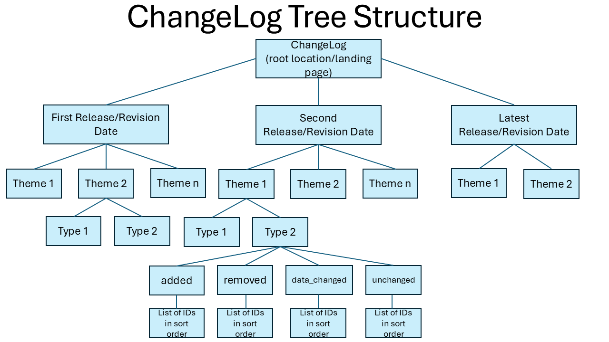

[obligation=normative]

== GERS Framework Requirements Classes and Requirements Packages

This Clause defines requirements classes with a standardization target of an implementation of the GERS Model and framework. Specifically, requirements defined in this clause are focused on the elements of the model required or recommended to implement a GERS framework consistent with the existing GERS implementation community. This clause does not define requirements for conflation, work flows, or storage/processing technologies.

=== Summary of GERS Framework Requirements Classes/Packages

The following table lists the mandatory and optional requirements classes for an implementation of the GERS Framework.

|===
| *Requirements class* | Description | Optional/Conditional/mandatory
| <<req-gers-general-7,requirements_class-gers-general>> | General system wide requirements | Conditional
| <<req-class-crs-7,requirements_class-gers-crs>> | Requirements for Coordinate Reference SYstems | Conditional
| <<req-class-id-7,requirements_class-gers-id>>  | Requirements for generation of a GERS ID      | Mandatory
| <<req-class-bridge-7,requirements_class-gers-bridge>> | Requirements for Bridge Files              | Mandatory
| <<req-class-registry-7,requirements_class-gers-registry>> | Requirements for the Registry File       | Optional
| <<req-class-changelog-7,requirements-class-gers-changelog.adoc>> | Requirements for ChangeLog File | Optional
| <<req-class-refmap-7,requirements-class-gers-refmap.adoc>> | Requirements for Referance Map | Optional
|===

NOTE: A complete implementation of the GERS framework requires implementation of all of the above requirements classes

[[req-gers-general-7]]

=== General requirements and recommendations

The following requirements package and recommendations specify "global" requirements pertinent to all schema, formats and so on used in an implementation of the GERS framework. 
Examples include the specification of language for properties of a name, specification of a bounding box, and time.

NOTE: A requirements package consists of one or more requirements classes and associated recommendations and permissions.

include::../requirements/requirements_package-gers-general.adoc[]

[[rec-gers-schema-7]]

==== Recommended Schema Conventions

The following recommendations for schema conventions are suggested so that any new implementations of the GERS Framework and Model are consistent with all current (2026 and later) implementation instances.

include::../recommendations/schema-recommended.adoc[]

[[req-gers-datetime-7]]

==== Date Time Requirement

The following is the requirement for expressing date and time in any GERS implementation, regardless of theme, type, or schema. This requirement is consistent with various OGC and ISO standards as well as with STAC.

include::../requirements/gers-general-datetime.adoc[]

An example of  a datetime string that complies with REQ001 is: `2024-10-15T00:00:00.000Z`

[[req-gers-bbox-7]]

==== Bounding Box requirement

The following requirement defines how to express a bounding box in the CRS of an impementation of the GERS framework. 

include::../requirements/gers-general-bbox.adoc[]

An example is as follows  {'xmin': 80.67177, 'xmax': 80.67182, 'ymin': 26.619795, 'ymax': 26.619843}

[[req-gers-geometry-7]]

==== Geometry requirement and recommendations

The following defines the requirements for expressing geometry in an implementation of the GERS framework including schemas and distributions. Geometry types used in an implementation 
of the GERS framework are compliant with ISO 19107: Spatial Schema, the OGC Simple Features Standard, and formats such as GeoJSON. The enumeration of geometry types currently used
in implementations of the GERS framework: geometry_collection, line_string, multi_line_string, multi_point, multi_polygon, point, polygon.

include::../requirements/gers-geometry.adoc[]

[[rec-gers-geometry-7]]

The following recommendation provides guidance on how a new implementation of the framework would be consistent (harmonized) with the OMF implementation. 

include::../recommendations/geometry-recommended.adoc[]

[req-gers-country-code]

==== Country Codes

The following requirement specified how country codes are provided.

include::../requirements/gers-country-code.adoc[]

[[req-class-crs-7]]

=== Requirement Class Coordinate Reference System (Conditional)

The CRS Requirements Class states that all coordinates used in any geometry, query, tiling scheme, and so on in an implementation of the GERS framework and model must be in the same (consistent) coordinate reference system (CRS).

NOTE: This requirements class is based on and is consistent with the CDB 2.0 and OGC API - Common CRS Requirements Classes.

include::../requirements/requirements_class-gers-crs.adoc[]

==== Requirement: CRS definition

The following requirement states that any CRS metadata used in a GERS implementation be consistent with OGC Abstract Specification Topic 2: Referencing by coordinates (ISO 19111:2019).

include::../requirements/crs-topic2.adoc[]

==== Requirement: Use same CRS Throughout

The following requirement states that any implementation of the GERS Framework compliant with this Community Standard specifies only one CRS. This requirement ensures that rigorous coordinate transformations as stated in OGC Topic 2 can be successfully performed without loss of data.

include::../requirements/crs-storage.adoc[]

==== Requirement: Valid CRS

The following requirement states that only non-projected coordinate reference systems are used in an implementation of the GERS framework. 
The are several reasons for this requirement, one of which is the possible use of global tiled storage systems for a GERS reference map.

include::../requirements/crs-valid.adoc[]

==== Requirement: CRS Epochs

In a dynamic CRS, coordinates of a point on the surface of the Earth may change with time. To be unambiguous, the coordinates 
must always be qualified with the epoch at which they are valid.

The conditional epoch requirement supports specifing an epoch for the case where a dynamic CRS is used.

include::../requirements/crs-epoch.adoc[]

==== Recommendation: OGC CRS84

In order to be consistent and compatible with existing framework implementations (as of 2026) as well as GeoParquet, GeoJSON and so on, the following recommendation states that a WGS84 2d CRS be used. Further, if a CRS is not specified then the default is WGS84 2d with axis order longitude/latitude. This is known as OGC CRS84.

include::../recommendations/REC002-CRS.adoc[]

[[req-class-id-7]]
=== Requirements Class GERS ID (Mandatory)

As of the June 2025 release of the GERS schema and model, all GERS IDs are UUIDs: 128-bit, randomly-generated identifiers (https://www.rfc-editor.org/rfc/rfc9562.html#name-uuid-version-4[UUID v4]) that are kept stable across data releases and updates. These IDs are stored as strings with dashes: xxxxxxxx-xxxx-xxxx-xxxx-xxxxxxxxxxxx . UUID v4 is meant for generating UUIDs from truly random or pseudorandom numbers.

NOTE: This Community Standard does not specify how the GERS ID is generated. This is up to the organization implementing the GERS framework/model. The following requirements also do not preclude the organization from using an existing GERS implementation, such as from Overture Maps, as the source of a GERS ID. 

The following is the GERS ID Requirements Class

include::../requirements/requirements_class-gers-id.adoc[]

==== Requirement: Every entity has an associated GER-ID

The following requirement states that every entity in a GER compliant implementation has a unique ID

include::../requirements/must-have-id.adoc[]

==== Requirement: ID is generated using UUID v4

The following requirement states that a GERS ID is generated using the rules as defined in UUID v4

include::../requirements/id-is-uuid.adoc[]

[[req-class-bridge-7]]

=== Requirements Class Bridge Files

Bridge files connect GERS IDs to the feature IDs used in the source data. Stated another way, a bridge file is essentially a join table, connecting GERS identifiers with another set of identifiers. 

These files are a key component of a GERS implementation and offer two critical capabilities: Reverse lookup of source features and insight into the conflation process used. Bridge files should be updated whenever GERS content is updated with new, changed, ot deleted source data.

include::../requirements/requirements-class-gers-bridge.adoc[]

==== Structure of the BridgeFile name

include::../requirements/gers-bridgefile-name.adoc[]

==== BridgeFile Schema Content

include::../requirements/gers-bridgefile-schema.adoc[]

The bridge file schema consists of the following columns:

|===
|Column	| Data type	| Description
|id	| string |	A feature's GERS ID and is populated from the id column in the map data schema
|record_id	| string	| The ID (identifier) of the feature in the source data provider (e.g. n2757802019@9) and is populated by parsing the `sources` column in the map data schema.
|update_time	| string	| The time the feature or dataset was updated, depending on the data provider. Populated by parsing the `sources` column in the Overture schema.
|dataset	| string	| The name of the source dataset in which the feature is contained. Populated by parsing the `sources` column in the primary data schema.
|theme	| string |	The theme the feature is a part of, provided by the creator of the bridge file itself.
|type	| string	| The type of the feature, either derived from the data or provided by the creator of the bridge file.
|between	| array	| The portion of the normalized length of the GERS feature the dataset way takes, represented by a range between 0 and 1.
|dataset_between	| array	| The portion of the normalized length of the dataset way the GERS feature takes, represented by a range between 0 and 1.
|===

NOTE: The `between` property is applicable to segments contained in a lineal feature dataset, such as Roads or Streams. The concept is similar to how a position on a linear segment is identified in a linear reference system.

==== Example of BridgeFile query

https://docs.overturemaps.org/gers/bridge-files/#example-examining-the-source-data-for-the-building-dataset[An example query of a bridge file maintained in the Overture Maps implementation]. This query assumes that the BridgeFile information is maintained in an S3 GeoParquet structured bucket.

[[req-class-registry-7]]

=== Requirements Class Registry (Optional)

With each data update (release), the Registry is also updated. A data update could be the inclusion of a new geospatial data source or an update to an existing geospatial data source. The GERS Registry serves as the single source of truth for all entities that are part of an implmentation of the GERS model/framework. It serves as a comprehensive catalog that tracks every stable ID ever published across all data updates in an implementation of the GERS framework.

If an implementation of the GERS framework requires a Registry, then the following requirements class is mandatory.

include::../requirements/requirements-class-gers-registry.adoc[]

==== GERS registry file name

The following requirement defines the physical name for a GERS registry file. Please note that this name can be included in a longer URI/URL path to the actual location of the registry file. 

include::../requirements/gers-registry-name.adoc[]

==== Schema for GERS registry file

The following requirement states that using the registry schema defined in Table xyz below is mandatory.

include::../requirements/gers-registry-schema.adoc[]

|===
|Column	| Data type	| Description | DCAT property
|id	| string	| GERS conformant identifier (UUID) | dcat:indentifier
|version	| integer	| Current version number of the feature, incremented in each release whenever the geometry or attributes of this feature change. | dcat:version
|first_seen	| string	| Release number when entity/feature first appeared in a GERS framework compliant repository | dcterms:issued
|last_seen	| string	| Most recent release containing entity/feature | dcat:version
|last_changed	| string	| Last release in which the entity/feature was changed, sourced from ChangeLog | dcterms:modified
|path	| string	| Relative path (URI) to entity/feature in latest release of the ReferenceMap. |  
|bbox	| struct(xmin float, xmax float, ymin float, ymax float)	| Bounding box coordinates in the CRS of the GERS framework implementation. | dcat:bbox
|===

==== Updates to the Registry File

The following requiremehnt defines the rules for how updates are performed on the GERS regsitry.

include::../requirements/gers-registry-updates.adoc[]

NOTE: The Registry can be used to verify that an entity exists in an implmentation of a GERS framework, track the history of that entity, and find new entities that have been added.

==== Example query of a GERS Compliant Registry (Example from Overture)

You can use the GERS Registry to verify that an entity exists in the GERS framework data, track the history of that entity, and find new entities that have been added. For example, a user might ask, "Is fea28f69-7afa-460c-b270-61ef74cd340c part of GERS compliant datastore?" The user can query the Registry to find out:

```
SELECT 
    *
FROM read_parquet('s3://overturemaps-us-west-2/registry/*.parquet')
WHERE id='fea28f69-7afa-460c-b270-61ef74cd340c';
```

The query response will show that fea28f69-7afa-460c-b270-61ef74cd340c is a building first released in the Overture GERS i9plementation in June 2025 and last seen in August 2025 (2025-08-20.1), the current release. The exact bounding box of the feature is {'xmin': 80.67177, 'xmax': 80.67182, 'ymin': 26.619795, 'ymax': 26.619843} and the relative path to the feature is /theme=buildings/type=building/part-00149-8a741876-e04d-4e66-bc96-0171910fa1b1-c000.zstd.parquet.

[[req-class-changelog-7]]

=== Requirements Class ChangeLog (Optional)

The following defines the requirements class `ChangeLog`. With each data release, a `changelog` that capture changes in the data from the previous release to the current release is published. The changes are tied to the GER ID for each feature. This information enables users to see changes over time for individual entities (features) or groups of entities (features). This information can also be used to guide decisions about data matching, better understand data stability, and help detect data errors. There is a ChangeLog dataset for each release.

NOTE: The concept of `release` is the same as `version` in the OGC CDB 2.0 Standard.

The data contained in a `changelog` is made available in some file or database system and is partitioned by theme, type, and change_type and sorted geospatially with a unique index on id. The `changelog` files are available at a physical location as defined in a given implementation of the `changelog` resource.

The following is the ChangeLog Requirements Class

include::../requirements/requirements-class-gers-changelog.adoc[]

==== Requirement: ChangeLog file name

The following requirement defines the naming conventions for the ChangeLog file/dataset.

include::../requirements/gers-changelog-name.adoc[]

Examples might be:

. For Amazon S3 bucket: s3://<ger-datastore-name>/changelog/<RELEASE> where:
.. ger-datastore-name is the name/location of the content
.. release is the latest release date, such as 2026-01-21.0/
. In a CDB 2.0 datastore, the path could be /global_metadata/changelog/2026-01-21.0

==== ChangeLog Schema

The change_type property in the changelog includes these types of changes to the entities:

- added: the entity with this ID is new in the current release and was not present in the previous release
- removed: the entity with this ID is not present in the current release but was present in the previous release
- data_changed: the entity with this ID in the current release contains a change in geometry or properties from the entity with this ID that was in the previous release
- unchanged: the entity with this ID in the current release matches the geometry and properties of the entity with this ID that was in the previous release


==== ChangeLog Release Dataset Structure

Diagrammtically, the `changelog` structure can be abstracted as follows.



This above structure is implementation independent. An implementation could be a Unix or Windows file system. 
An implementation could be an S3 set of prefixes to organize ChangeLog storage. A prefix is a logical grouping of 
the objects in a bucket. Or an implementation could be one or more normalized relational tables. 

[[req-class-refmap-7]]
=== Requirement Class Reference Map (Optional)

This section defines the requirements for the optional GER-ID reference map. 

include::../requirements/requirements-class-gers-refmap.adoc[]

==== Requirement: Path to a given reference map

The following requirement states how a path to a given reference map is structured. This path could be to a file in a 
file oriented storage system, "table" paths in an RDMS, or S3 buckets path using slashes.

include::../requirements/path-to-reference-map.adoc[]

Where the components of the path are:

|===
|<root>     | Implementation dependent but the root location where a path to a set of files begins. 
Could be `"/"` for a CDB datastore or `s3://store_name/...` in an GeoParquet S3 implementation or an `https://` landing page.
|release    | Always in the path and follows the <root> string.
|<RELEASE> | date-based version in the format yyyy-mm-dd.x.
|<theme>    | theme name such addresses, base, buildings, divisions, places, or transportation.
|<type>     | A feature type within a theme, such as railways or interstates in a transportation theme.
|===

==== Requirement: Reference Map minimum metadata/properties

Any content stored in a ReferenceMap has a minimum set of required elements/properties. The minimum set of elements/properties 
is the same for all themes and types in a GER framework compliant ReferenceMap. The minimum set of elements/properties 
can be extended as necessary. An example of such an extended set of metadata/properties is https://docs.overturemaps.org/schema/reference/base/water/[here].
Also, a given implementation of the framework may have additional mandatory elements for a given theme. For example, a `landuse` theme may have a mandatory 
land use code property. However, such rules are specific to a given implementation of the framework.

include::../requirements/reference-map-mandatory-elements.adoc[]

NOTE: The rationale for specifying this mandatory set of elements to allow maintaining consistency with all existing implementation of the framework.


